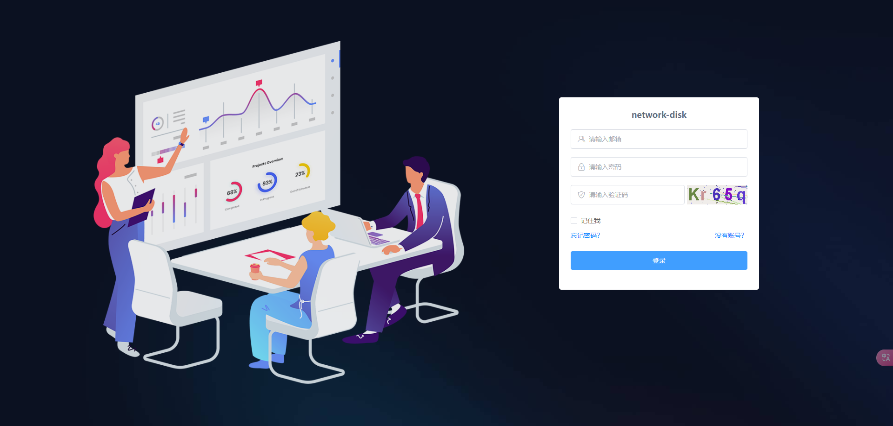
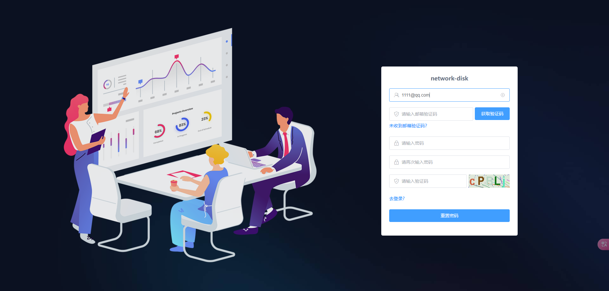
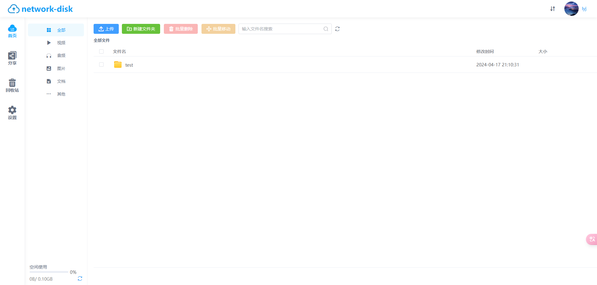
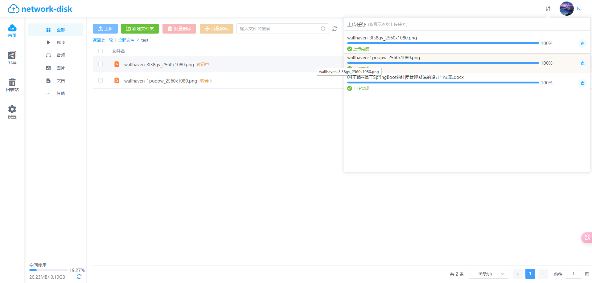
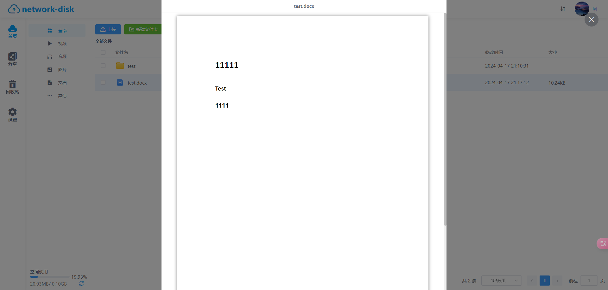
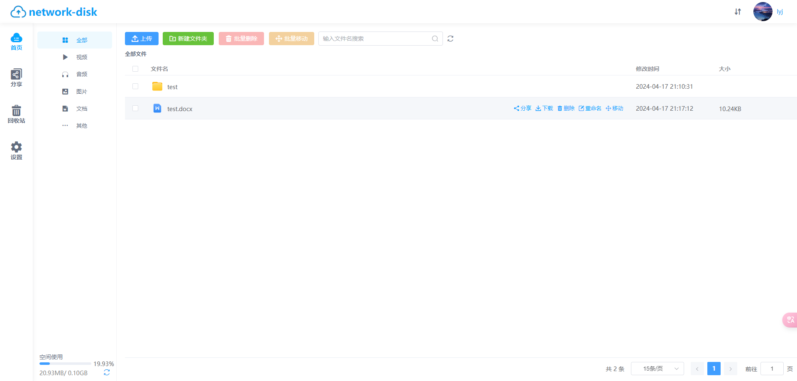
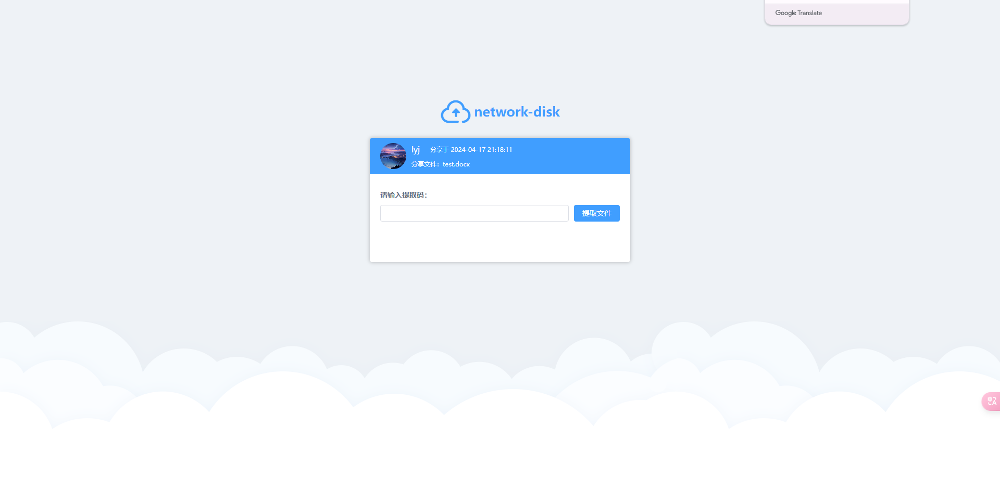
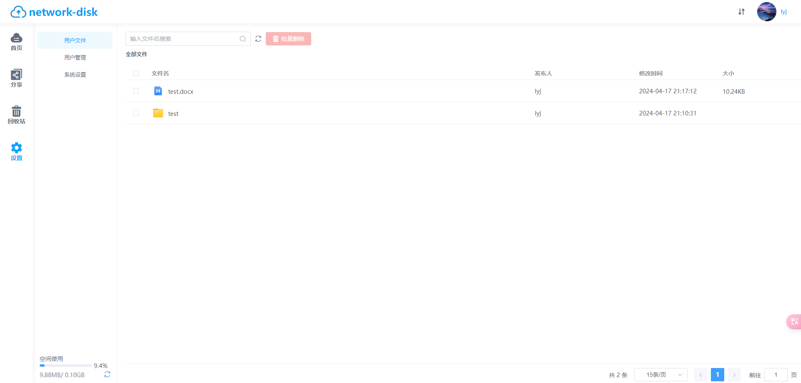
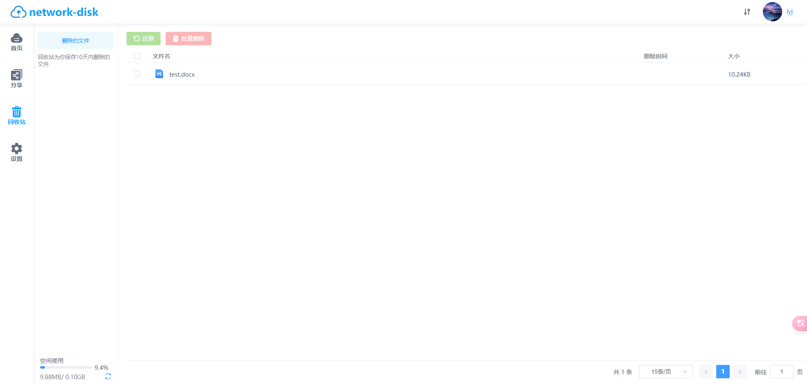

本项目是一个简单的网盘系统，主要实现了网盘的登录注册，文件的批量上传、新建、在线预览、下载、链接分享、移动以及删除还原等功能。
`network-disk-server`为服务端，`network-disk-web`为web端
服务端管理员账号：admin@qq.com  密码：a1234567
# 效果图
**登录注册页面**

**找回密码界面**

**主页**

**批量上传文件**

**文件预览**

**文件下载**

**文件分享**

**管理员**

**回收站**

# 主要功能
*  用户
	* 登录/注册
	* 找回密码
	* 发送邮箱验证码
* 文件批量上传
	* 分片上传
	* 秒传
	* 断点续传
	* 取消上传
* 文件列表
	* 新建文件夹
	* 文件在线预览
	* 文件下载
	* 文件分享
	* 文件删除
	* 文件重命名
	* 文件移动
* 分享
	* 取消分享
	* 复制分享链接
* 回收站
	* 彻底删除
	* 还原
* 管理员
	* 用户文件列表
		* 删除文件
		* 预览/下载文件
	* 用户管理
		* 分配空间
		* 启用/禁用用户账号
* 外部分享
	* 通过分享查看文件列表
	* 预览文件
	* 保存到我的网盘